<h1>Introducing "Avurudu 2026" – My Complete Sinhala & Tamil New Year Companion! ✨</h1>

I am excited to share my latest personal project: "Avurudu 2026" a cross-platform mobile application I developed from scratch using React Native and Expo.
As a SE Intern I took this as a challenge to build a fully functional application to help everyone celebrate the Sinhal and Tamil new year with ease.

<b>✨ Key Features:</b>
Real-time Auspicious Times (Nakath): Stay updated with live countdowns for all traditional rituals.
Traditional Recipes: Step-by-step guides to making your favorite New Year treats.
Traditional Games: Detailed descriptions of classic New Year games.
Custom Greeting Card Generator: Create and share personalized New Year wishes with your name and photo!
Multi-language Support: Seamlessly switch between Sinhala and English for a better user experience.

🛠️ Tech Stack:
Frontend: React Native | Expo | TypeScript
Navigation: Expo Router
Deployment: Netlify (Web) | EAS (Android APK)
Features: Multi-language Localization (i18n), Custom Image Generation.

<h2><b>Project Output</b></h2>

<h3>Sinhala Translation</h3>
<table>
  <tr>
    <td>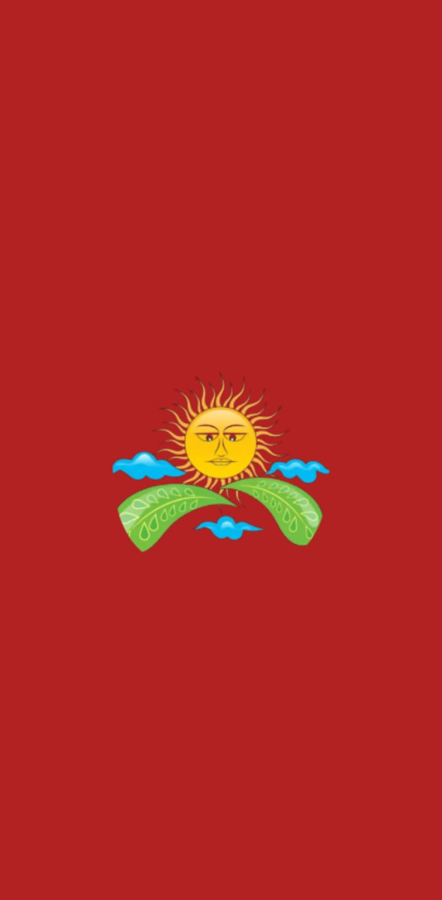</td>
    <td>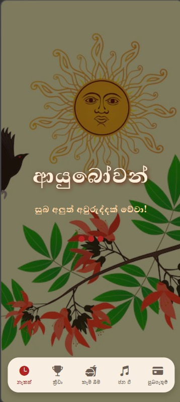</td>
    <td>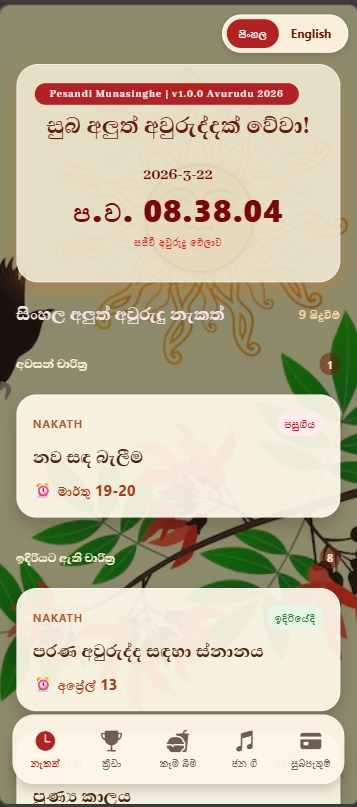</td>
    <td>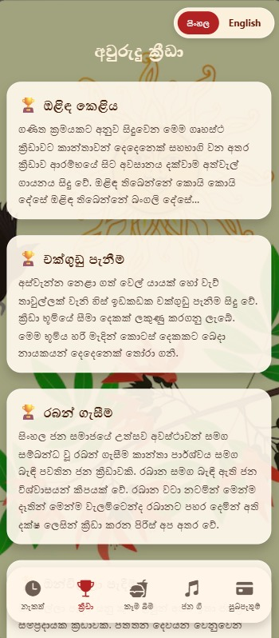</td>
  </tr>
  <tr>
    <td>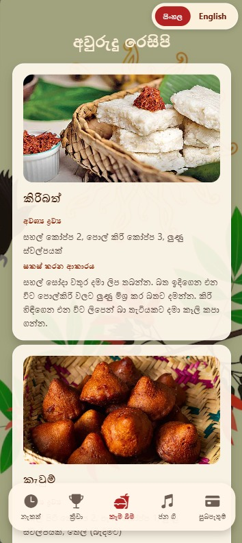</td>
    <td>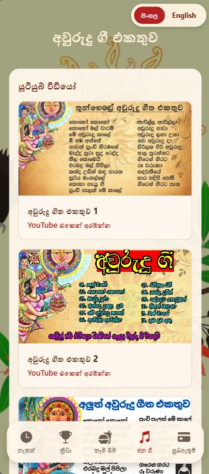</td>
    <td>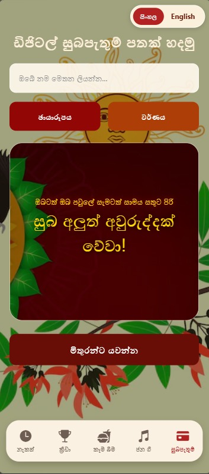</td>
    <td></td>
  </tr>
</table>

<h3>English Translation</h3>
<table>
  <tr>
    <td></td>
    <td></td>
    <td>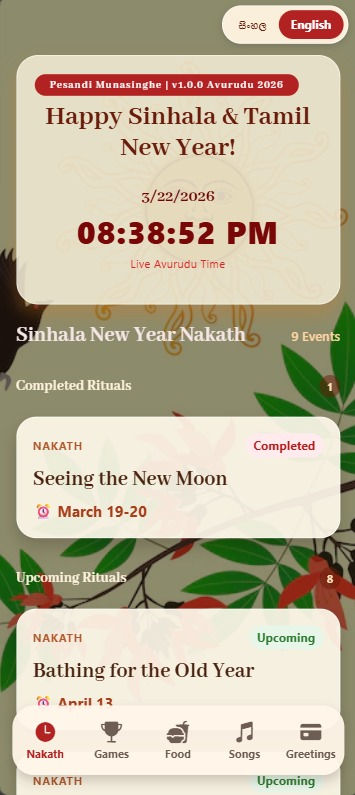</td>
    <td>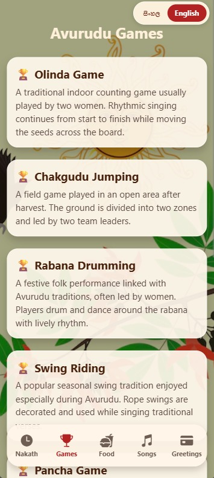</td>
  </tr>
  <tr>
    <td>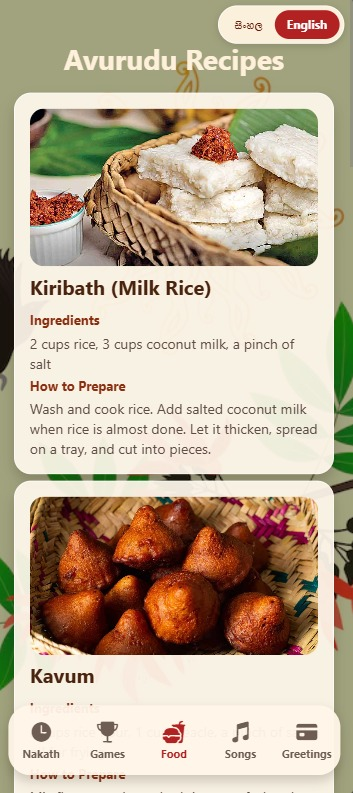</td>
    <td>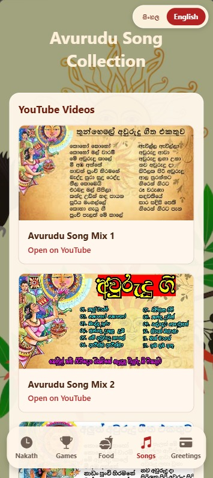</td>
    <td>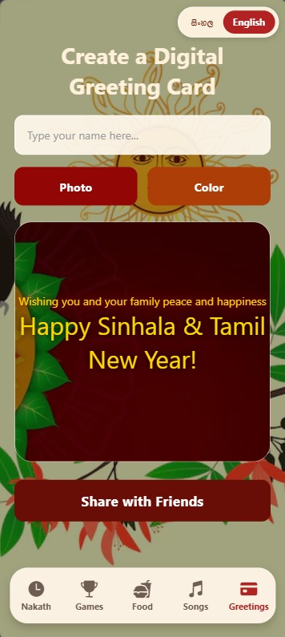</td>
    <td></td>
  </tr>
</table>

🔗 Try it out now: 
🌐 Live Web Demo (Android, iOS & PC): [https://avurudu2026.netlify.app/] 
📥 Download Android App (APK): [https://expo.dev/.../bf9a433e-2671-49d2-b6ca-0343e328c842]

I handled the entire development process, including UI/UX design core logic, and multi language implementation.
  
#ReactNative #Expo #MobileAppDevelopment #SinhalaNewYear #SriLankaTech #SoftwareEngineering #PortfolioProject #WebDevelopment #AppDesign #InternshipProject
